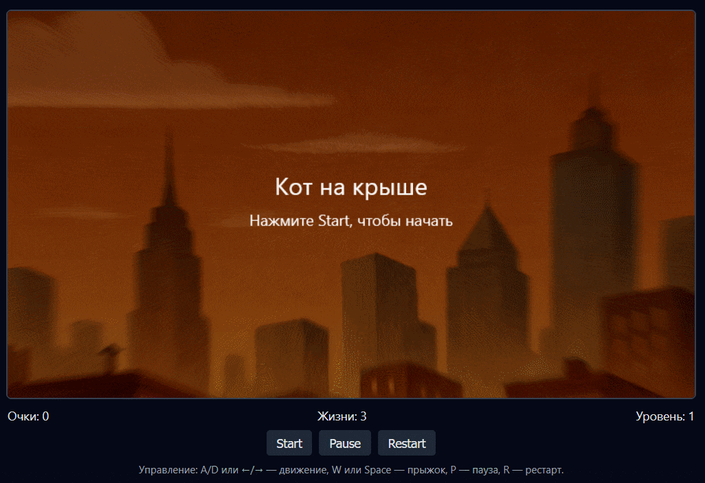

# Кот на крыше (Rooftop Cat)

Веб-игра в жанре платформер на JavaScript и Canvas API.

Игрок управляет рыжим персидским котом, который бегает по крышам города, собирает рыб, перепрыгивает пропасти и избегает ворон и опасных препятствий.



---

## Ссылка на игру

- **GitHub Pages:** `https://DynamiteNonsense.github.io/RooftopCat/`  

---

## Использование нейросети

- **Использованная нейросеть:** ChatGPT (модель GPT-5.1)
- **Время работы над заданием:** около 2-3 часов


## Стек технологий

- **HTML5 Canvas API** — отрисовка игры
- **Vanilla JavaScript (ES6 modules)** — логика игры
- **CSS** — оформление интерфейса
- Дополнительно:
  - Аудио через стандартный `HTMLAudioElement`
  - Логическая архитектура на классах (Game, Player, Platform и т.д.)

- **Части проекта, сделанные с помощью нейросети:**
  - Генерация основного кода:
    - игровой цикл на `requestAnimationFrame`;
    - управление персонажем (влево/вправо, прыжок);
    - гравитация и физика;
    - система коллизий с платформами, врагами, препятствиями и бонусами;
    - логика очков, жизней, смены уровней и состояний игры
      (меню, пауза, проигрыш, победа, переход между уровнями);
    - обработка клавиатурного ввода и кнопок интерфейса.

- **Части, сделанные вручную:**
  - Выбор тематики игры;
  - Подбор/создание звуковых файлов (`.wav`, `.mp3`);
  - Исправление расположения объектов и коллизий, добавление "состояния" прохождения игры (вместо "игра окончена" появляется надпись "игра пройдена");
  - Исправление графической части игры;
  - Добавление обработки дополнительных клавиш (R для рестарта и т.д.); 
  - Сборка проекта и публикация на GitHub Pages.

---

## Структура проекта

```text
index.html          — основной HTML, canvas и UI
README.md           — этот файл

css/
  style.css         — стили для игры и интерфейса

js/
  main.js           — точка входа, запуск игрового цикла
  Game.js           — основной класс игры (состояния, уровни, очки, жизни)
  Player.js         — класс кота (движение, физика, анимация)
  Platform.js       — платформы-крыши
  Collectible.js    — собираемые предметы (рыбы и золотая рыба-пузырь)
  Enemy.js          — враги (вороны)
  Obstacle.js       — препятствия
  Collision.js      — система коллизий (обработка столкновений)
  InputHandler.js   — обработка нажатий клавиш
  Renderer.js       — отрисовка фона, HUD и экранов (меню/пауза/итог)
  LevelData.js      — описание уровней (платформы, враги, бонусы, цели)

assets/
  demonstration.gif   — GIF-демонстрация игры
  images/
    bg_city.png       — фон города
    cat_idle.png      — кот, стоит
    cat_run.png       — кот, шаг 1 
    cat_run_2.png     — кот, шаг 2
    cat_jump.png      — кот в прыжке
    cat_fall.png      — кот в падении
    fish.png          — обычная рыба-пузырь
    fish_gold.png     — золотая рыба-пузырь
    crow.png          — ворона, крылья вверх
    crow_2.png        — ворона, крылья вниз
    tiles_roof.png    — тайл крыши
    goal_door.png     — дверь — финиш уровня

  sounds/
    bg_music.mp3      — фоновая музыка
    jump.wav          — звук прыжка
    collect.wav       — звук подбора рыбы
    hit.wav           — получение урона
    gameover.wav      — звук поражения
    level_complete.wav— звук завершения уровня

